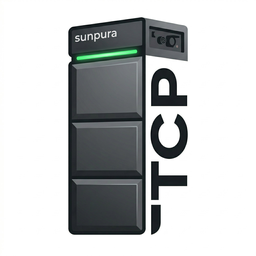

# Sunpura Local TCP Control

[](https://github.com/hacs/integration)
[](https://github.com/Mathieuleysen/Sunpura-Local-TCP/releases)


A Home Assistant custom integration that provides **direct local TCP control** of Sunpura EMS battery systems — no cloud, no latency, no dependency on external servers.

<p align="center">
  
</p>

---

## ✨ Features

- **Local-only** — communicates directly with your battery over your LAN
- **Fast polling** — 2-second update interval with intelligent failure tolerance
- **Power setpoint control** — charge or discharge at any wattage up to the battery's rated maximum
- **Work mode selector** — switch between Self-Consumption (AI), Custom/Manual, and Disabled
- **EMS enable/disable switch** — master on/off for the energy management system
- **Battery sensors** — AC Charging Power, Battery Discharging Power, Battery SOC
- **Developer services** — read/write raw registers, scan register ranges, send arbitrary commands

---

## 🔧 Requirements

- Home Assistant **2024.1.0** or newer
- Your Sunpura battery must be on the **same local network** as Home Assistant
- You need the battery's **static IP address** and **TCP port** (typically `6001` or `8001`)

---

## 📦 Installation via HACS

1. Open **HACS** in Home Assistant
2. Go to **Integrations**
3. Click the three-dot menu → **Custom repositories**
4. Add `https://github.com/Mathieuleysen/Sunpura-Local-TCP` as an **Integration**
5. Search for **Sunpura** and click **Download**
6. Restart Home Assistant

---

## ⚙️ Manual Installation

1. Download the latest release from [GitHub Releases](https://github.com/Mathieuleysen/Sunpura-Local-TCP/releases)
2. Copy the `custom_components/sunpura_local` folder into your Home Assistant `config/custom_components/` directory
3. Restart Home Assistant

---

## 🚀 Configuration

1. Go to **Settings → Devices & Services → Add Integration**
2. Search for **Sunpura Battery**
3. Enter your battery's **IP address**, **TCP port**, and a **friendly name**

> You can update the IP/port at any time via the integration's **Configure** button — Home Assistant will reconnect immediately.

---

## 🖥️ Entities

| Entity | Type | Description |
|---|---|---|
| `Power Setpoint` | Number | Charge (+W) or discharge (−W) power target |
| `Work Mode` | Select | Self-Consumption (AI) / Custom / Disabled |
| `EMS Enabled` | Switch | Master enable for the EMS controller |
| `AC Charging Power` | Sensor | Current AC charging power in W |
| `Battery Discharging Power` | Sensor | Current discharge power in W |
| `Battery SOC` | Sensor | State of charge in % |

---

## 🛠️ Developer Services

These services are available under **Developer Tools → Services** for advanced debugging and register exploration:

### `sunpura_local.read_registers`
Read a list of raw register addresses and inspect their values. Results appear in the `Power Setpoint` entity's attributes under `register_scan`.

```yaml
service: sunpura_local.read_registers
data:
  addresses: [3000, 3001, 3002, 3003, 3023, 3024]
```

### `sunpura_local.set_raw_register`
Write any value to any register. Useful for experimenting.

```yaml
service: sunpura_local.set_raw_register
data:
  address: "3003"
  value: "1,14:00,23:59,-2400,0,6,0,0,0,100,10"
```

### `sunpura_local.scan_power_registers`
Scan registers 3000–3150 and 4000–4050 for non-zero values. Run while charging/discharging to identify active registers.

```yaml
service: sunpura_local.scan_power_registers
```

### `sunpura_local.try_command`
Send any Get or Set command to the battery and log the full response.

```yaml
service: sunpura_local.try_command
data:
  direction: "Get"
  command: "EnergyParameter"
```

---

## 📐 Power Setpoint Sign Convention

| UI value | Effect |
|---|---|
| `+2400` | Charge at 2400 W |
| `0` | Idle (stops active command) |
| `−2400` | Discharge at 2400 W |

Internally the register sign is **inverted** (negative = charge) — the integration handles this automatically.

---

## 📋 Known Register Map

| Register | Description | Confirmed value |
|---|---|---|
| `3000` | EMS enable (0=off, 1=on) | ✅ |
| `3003` | controlTime1 — power schedule slot | ✅ |
| `3021` | AI smart charge (0=off, 1=on) | ✅ |
| `3022` | AI smart discharge (0=off, 1=on) | ✅ |
| `3023` | Min discharge SOC (%) | ✅ 10% |
| `3024` | Max charge SOC (%) | ✅ 98% |
| `3030` | Custom mode (0=off, 1=on) | ✅ |
| `3039` | Max feed power (W) | ✅ 2400 W |

---

## 🐛 Troubleshooting

**Entities show "Unavailable"**
- Verify the battery IP and port are reachable: `ping <battery-ip>` from your HA host
- Check Home Assistant logs for connection errors

**Power setpoint has no effect**
- Ensure **Work Mode** is set to `Custom / Manual`
- Ensure **EMS Enabled** switch is ON
- Use `sunpura_local.scan_power_registers` to confirm register 3003 is being written

**Slow response after setting power**
- The firmware has a brief processing pause after a SET command (~2 s with the fast path)
- The integration tolerates 5 consecutive polling failures before marking entities unavailable

---

## 📄 License

MIT — see [LICENSE](LICENSE)
